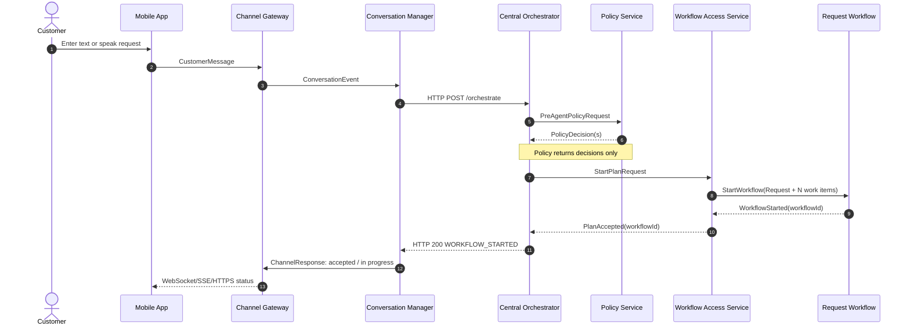
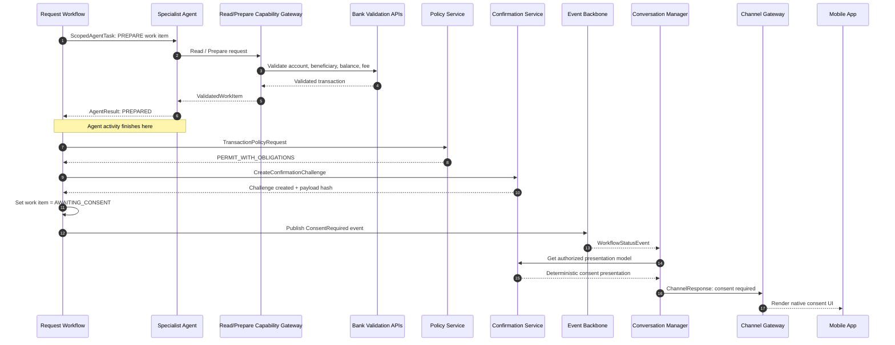

# Conversational Banking Agent Platform

## Customer Architecture Summary

### Purpose

This document describes a channel-neutral conversational banking platform for:

- Mobile text conversation
- Mobile real-time audio
- Contact-center voice
- Single-intent and multi-intent customer requests
- Retail-banking transaction preparation and execution
- Knowledge questions
- Human handoff

The core architecture principle is:

> **AI understands and prepares. Policy controls access. The customer confirms. The durable workflow coordinates execution. Deterministic services call banking APIs. Bank systems remain authoritative.**

---

## 1. Core execution model

One customer request creates exactly one durable request workflow.

```text
1 customer request
        =
1 durable Request Workflow
        =
N work items
```

Example customer request:

> “Check my balance, transfer THB 10,000 to Somchai, then pay my electricity bill.”

The workflow contains:

| Work item | Type | Dependency | Confirmation |
|---|---|---|---|
| WI-1: Balance inquiry | Read-only | None | Not required |
| WI-2: Funds transfer | Financial | None | Required |
| WI-3: Bill payment | Financial | WI-2 must complete | Required separately |

The workflow may prepare independent work items in parallel. A dependent work item remains blocked until the bank authoritatively completes the prerequisite.

---

## 2. Major component responsibilities

### Mobile App

- Captures text or audio input.
- Renders conversation messages, work-item status and consent cards.
- Uses native biometric or app PIN for transaction approval.
- Sends structured consent decisions.
- Does not interpret intent or execute banking logic.

### Channel Gateway

- Authenticates the mobile or channel session.
- Routes natural-language messages to the Conversation Manager.
- Routes structured consent decisions to the Confirmation Service.
- Maintains WebSocket, Server-Sent Events or HTTPS delivery.
- Applies rate limits, schema validation and transport security.

### Conversation Manager

- Owns conversation and turn state.
- Calls the Central Orchestrator for natural-language requests.
- Listens to customer-visible workflow events.
- Maintains a customer-facing projection of workflow status.
- Builds channel-neutral responses for running status and consent presentation.
- Sends responses through the Channel Gateway.
- Does not own authoritative transaction state.

### Central Orchestrator

- Identifies one or more candidate intents.
- Creates a proposed work-item plan and dependency graph.
- Calls pre-agent policy.
- Applies policy decisions.
- Starts one Request Workflow through Plan Intake or Workflow Access Service.
- Does not execute financial transactions.
- Is bypassed for structured consent approval.

### Policy Service

- Acts as a policy decision point.
- Returns `PERMIT`, `DENY` or `PERMIT_WITH_OBLIGATIONS`.
- Evaluates agent invocation, context sharing, tool grants, model profile and transaction obligations.
- Is called before agent invocation and again after transaction validation.
- Does not invoke agents.
- Does not start or resume workflows.

### Request Workflow

- Owns durable state for the complete customer request.
- Contains N work items.
- Owns work-item dependencies, sequence and parallelism.
- Invokes specialist-agent preparation activities.
- Calls transaction policy and Confirmation Service.
- Waits durably for customer consent.
- Invokes deterministic transaction workers after valid consent.
- Owns retries, idempotency and unknown-outcome reconciliation.

### Specialist Agent

- Receives one scoped work-item preparation task.
- Resolves banking parameters.
- Calls approved read and prepare APIs.
- Returns a typed prepared work item.
- Does not call Commit APIs.
- Does not wait for customer consent.

### Capability Gateway

The gateway should logically separate three API classes:

1. **Read APIs**: balances, accounts, beneficiaries and statements.
2. **Prepare and Validate APIs**: transaction preparation, fees, limits and eligibility.
3. **Commit APIs**: financial posting, cancellation and approved compensation.

Specialist agents may access Read and Prepare APIs. Only workflow-controlled transaction workers may access Commit APIs.

### Confirmation Service

The Confirmation Service is the trusted consent verifier and evidence recorder.

It:

- Creates or stores the canonical consent challenge.
- Binds consent to the exact validated transaction using a payload hash.
- Validates challenge ownership and expiry.
- Validates the required biometric or app-PIN evidence.
- Prevents challenge reuse.
- Creates an immutable `ConfirmationRecord`.
- Does not invoke the Orchestrator.
- Does not execute the transaction.

Simple explanation:

> **The Confirmation Service proves that the customer approved the exact transaction shown in the consent UI.**

### Workflow Access Service

The Workflow Access Service is an internal service or logical adapter in front of the selected workflow engine.

It exposes stable operations such as:

- Start workflow
- Send command or signal
- Query customer-visible workflow state
- Cancel request or work item

It:

- Accepts typed HTTP commands.
- Authenticates the calling service.
- Validates and deduplicates commands.
- Resolves the target workflow instance.
- Translates the command into a Temporal signal/update, Camunda correlated message, Durable Functions external event or bank-BPM equivalent.
- Returns an acknowledgement.
- Does not own business workflow state.
- Does not execute the banking transaction.

Simple explanation:

> **The Workflow Access Service tells the correct running workflow that a verified customer action has occurred.**

### Transaction Worker

- Is deterministic application code, not an LLM agent.
- Is invoked by the Request Workflow.
- Verifies policy, confirmation, payload hash, expiry and dependencies.
- Calls the Commit Gateway using an execution-only workload identity.
- Returns the activity result to the Request Workflow.

### Bank APIs and Systems of Record

- Validate and post financial operations.
- Own balances, limits, postings and transaction references.
- Return authoritative transaction status.
- Provide status-reconciliation APIs for unknown outcomes.

---

## 3. Natural-language request start



### Meaning of `WORKFLOW_STARTED`

`WORKFLOW_STARTED` means the request was interpreted and accepted into durable processing. It does not mean that banking transactions have completed.

---

## 4. Work-item preparation and consent request



### Important behavior

- The Specialist Agent does not remain active while waiting for consent.
- The Request Workflow persists `AWAITING_CONSENT` and waits without occupying an agent or worker thread.
- Independent work items may continue while one financial work item waits for customer approval.
- Each financial work item has a separate challenge and payload hash.

---

## 5. Customer consent and workflow resume

Structured consent bypasses the Central Orchestrator because no natural-language interpretation is required.

```mermaid
sequenceDiagram
    autonumber
    actor Customer
    participant Mobile as Mobile App
    participant Gateway as Channel Gateway
    participant Confirm as Confirmation Service
    participant WA as Workflow Access Service
    participant WF as Existing Request Workflow
    participant Worker as Transaction Worker
    participant Commit as Commit Gateway
    participant Bank as Bank API / Core
    participant Events as Event Backbone
    participant CM as Conversation Manager

    Customer->>Mobile: Approve using biometric / app PIN
    Mobile->>Gateway: POST consent decision
    Gateway->>Confirm: Structured ConsentSubmission
    Confirm->>Confirm: Validate challenge, customer, expiry, authentication and payload hash
    Confirm->>Confirm: Create ConfirmationRecord
    Confirm->>WA: WORK_ITEM_CONSENT_APPROVED command
    WA->>WF: Signal/update existing workflow
    WF-->>WA: Command accepted
    WA-->>Confirm: Delivered acknowledgement
    Confirm-->>Gateway: CONSENT_RECEIVED
    Gateway-->>Mobile: Confirmation received; processing

    WF->>WF: Verify record, policy, hash and dependencies
    WF->>Worker: ExecuteTransactionActivity
    Worker->>Commit: ExecuteTransactionRequest
    Commit->>Bank: BankInstruction
    Bank-->>Commit: AuthoritativeTransactionResult
    Commit-->>Worker: CommitResult
    Worker-->>WF: ActivityResult

    WF->>Events: Publish EXECUTING / COMPLETED / FAILED
    Events-->>CM: WorkflowStatusEvent
    CM->>Gateway: ChannelResponse with running/final status
    Gateway-->>Mobile: WebSocket/SSE/HTTPS update
```

### Immediate versus final response

| Response | Meaning |
|---|---|
| `CONSENT_RECEIVED` | Consent command was validated and accepted by the workflow path. |
| `EXECUTING` | Deterministic transaction execution has started. |
| `COMPLETED` | Bank confirmed the financial transaction completed. |
| `FAILED` | Bank or deterministic execution returned an authoritative failure. |
| `UNKNOWN` | The platform is reconciling transaction status and will not blindly retry. |

---

## 6. Running status and UI responsibility

The Conversation Manager listens to customer-visible workflow events.

Recommended events include:

```text
request.workflow.started
workitem.preparing
workitem.validating
workitem.awaiting_consent
workitem.consent_received
workitem.executing
workitem.blocked
workitem.completed
workitem.failed
workitem.unknown
request.workflow.completed
request.workflow.partial_failure
request.workflow.handoff_required
```

Responsibility split:

| Responsibility | Owner |
|---|---|
| Authoritative work-item state | Request Workflow |
| Consent challenge and proof | Confirmation Service |
| Customer-facing status projection | Conversation Manager |
| Transport delivery | Channel Gateway |
| Native visual rendering and biometric/PIN interaction | Mobile App |
| Banking outcome | Bank system of record |

The Conversation Manager may call the Central Orchestrator for natural-language composition or a clarification question. It does not need the Orchestrator for deterministic statuses such as `AWAITING_CONSENT`, `EXECUTING`, `COMPLETED`, `FAILED` or `UNKNOWN`.

---

## 7. Caller and executor summary

| Step | Caller | Executor | Result |
|---|---|---|---|
| Submit customer message | Mobile App | Channel Gateway | Authenticated message |
| Interpret natural language | Conversation Manager | Central Orchestrator | Candidate plan |
| Evaluate pre-agent policy | Central Orchestrator | Policy Service | Policy decision |
| Start durable request | Central Orchestrator through Workflow Access Service | Workflow Engine | One Request Workflow |
| Prepare work item | Request Workflow | Specialist Agent | Prepared work item |
| Read/validate banking data | Specialist Agent | Capability Gateway and bank validation APIs | Validated work item |
| Evaluate transaction obligations | Request Workflow | Policy Service | Confirmation and authentication obligations |
| Create consent challenge | Request Workflow | Confirmation Service | Challenge and payload hash |
| Deliver consent UI | Conversation Manager | Channel Gateway and Mobile App | Native consent screen |
| Validate approval | Channel Gateway | Confirmation Service | Confirmation Record |
| Resume workflow | Confirmation Service | Workflow Access Service | Workflow signal/update |
| Continue work item | Workflow Access Service | Existing Request Workflow | Work item resumes |
| Execute transaction activity | Request Workflow | Transaction Worker | Activity result |
| Commit transaction | Transaction Worker | Commit Gateway and Bank API | Authoritative bank result |
| Publish running status | Request Workflow | Event Backbone | Workflow status event |
| Update customer experience | Event Backbone | Conversation Manager | UI projection |
| Deliver status | Conversation Manager | Channel Gateway | Mobile update |

---

## 8. Suggested API separation

### Natural-language path

```text
POST /conversations/{conversationId}/messages
    → Conversation Manager
    → Central Orchestrator
```

### Consent-decision path

```text
POST /confirmation-challenges/{challengeId}/decision
    → Confirmation Service
    → Workflow Access Service
    → Existing Request Workflow
```

### Workflow access API

```text
POST /workflows
POST /workflows/{workflowId}/commands
GET  /workflows/{workflowId}/customer-visible-state
POST /workflows/{workflowId}/cancel
```

The Workflow Access Service may be deployed as an internal HTTP service or implemented as an embedded adapter library. A separate service is preferred when multiple channels, domains or workflow engines need a common interface.

---

## 9. Technology reference options

| Logical component | Reference options |
|---|---|
| Container runtime | Azure Kubernetes Service or another conformant Kubernetes platform |
| API gateway | Azure API Management, Kong, Apigee, NGINX or bank-standard gateway |
| Conversation Manager | Custom .NET, Java, Go or TypeScript service on Kubernetes |
| Central Orchestrator | Microsoft Agent Framework, Semantic Kernel, LangGraph or custom orchestration behind stable APIs |
| Policy Service | Open Policy Agent, Cedar, commercial platform or bank policy façade |
| Workflow engine | Temporal, Camunda 8, Azure Durable Functions or bank-standard BPM |
| Event backbone | Azure Service Bus, Kafka or bank-standard event platform |
| Confirmation Service | Custom deterministic microservice with relational evidence store and approved key management |
| Capability Gateway | OpenAPI-based APIs with OAuth 2.0 and optional mTLS |
| Observability | OpenTelemetry exported to Azure Monitor, ELK, Grafana or bank observability platforms |
| Secrets and keys | Azure Key Vault, bank HSM or approved secrets platform |

The application contracts should remain independent from the selected agent framework, model provider, speech provider and workflow engine.

---

## 10. Customer presentation summary

Use the following statement when presenting the design:

> One customer request creates one durable workflow containing multiple work items. The AI orchestrator identifies the intents and proposes the plan. Specialist agents prepare each banking work item using approved read and preparation APIs. Policy controls agent and transaction permissions. Every financial work item is bound to a deterministic customer consent challenge. The Request Workflow waits safely for consent, resumes through a standard Workflow Access Service, and invokes deterministic workers to call governed banking Commit APIs. The Conversation Manager continuously presents consent and running status to the customer, while bank systems remain authoritative for financial outcomes.

### Final architecture principle

> **Natural-language messages go through the Orchestrator. Structured UI actions go directly to deterministic services and the existing Request Workflow.**
